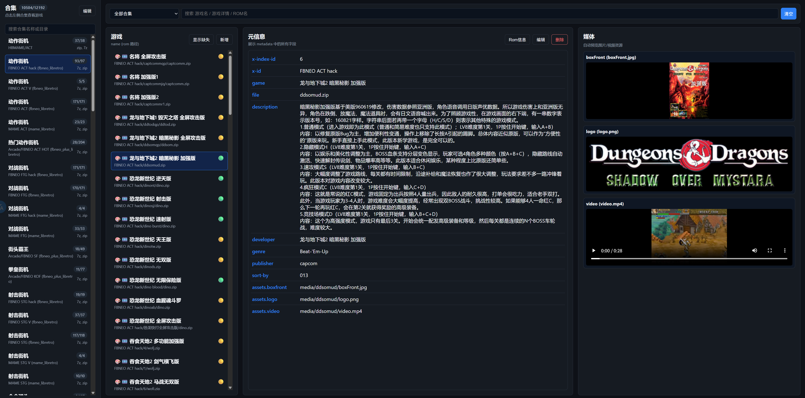

# retrog

一个几乎完全靠`Codex`实现的`Pegasus`元数据管理工具, 一开始做这个工具的主要是想管理`gamelist.xml`的, 后面发现`天马G`的已经有2.xT的游戏合集了, 就直接原地转型变成`metadata.pegasus.txt`管理工具了。

**注意: 纯AI实现, 使用前, 最好使用git对metadata.pegasus.txt进行版本化管理, 有问题及时回滚。**

## 安装

```bash
go install github.com/xxxsen/retrog/cmd/retrog@latest
```

## 运行

```bash
retrog web --dir=/path/to/rom/dir
```

## 截图



Powered by Codex
